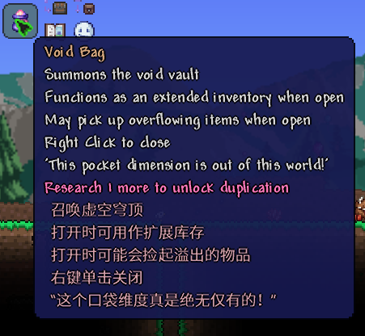
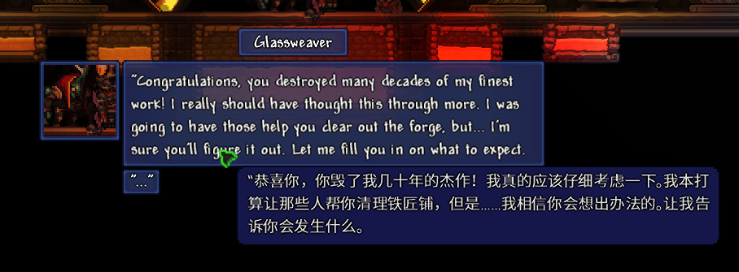

<h1 align="center">Machine Translate for Terraria</h1>

English | [简体中文](README.md)

Provides quick machine translation of in-game text, supporting text added by other mods.

## ✨ Functions
1. Quick translate item tooltip
2. Automatically translate chat messages
3. Multiple translation APIs are available 
   - With free translation API without API key required
4. Open the translation website via hotkey
   - You can choose to use Steam's built-in browser to open the website, which is convenient and fast
5. Automatically detect and translate the text your mouse is hovering at
6. Translated text cache, no need to re-translate after restarting the game

## 🧩 Screenshots

 

## 📄 Thanks to the following Open Source Projects and Users
* [akl7777777](https://github.com/akl7777777)
* [Newtonsoft.Json](https://github.com/JamesNK/Newtonsoft.Json)
* [Watt Toolkit](https://github.com/BeyondDimension/SteamTools)
* [划词翻译](https://github.com/hcfyapp)