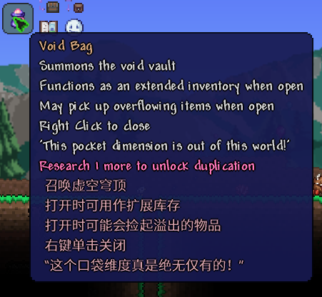

<h1 align="center">Terraria 机器翻译</h1>

[English](./README.en.md) | 简体中文

旨在为游戏内文本提供快捷机器翻译的模组，支持其他模组添加的文本。

## ✨ 功能
1. 翻译物品简介
2. 自动翻译聊天栏信息
3. 可选多种翻译API
    - 自带无需密钥的免费翻译API
4. 一键打开翻译网站
    - 可选使用Steam自带浏览器打开网站，方便快捷
5. 自动检测并翻译鼠标位置的文本
6. 附带完整的翻译API申请教程
7. 翻译文本缓存，重启游戏后不需要重新翻译

## 🧩 截图

 

## 📄 感谢以下开源项目/用户
* [akl7777777](https://github.com/akl7777777)
* [Newtonsoft.Json](https://github.com/JamesNK/Newtonsoft.Json)
* [Watt Toolkit](https://github.com/BeyondDimension/SteamTools)
* [划词翻译](https://github.com/hcfyapp)